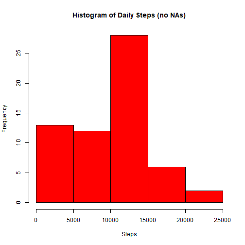
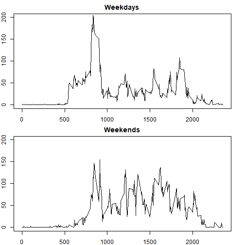

## Introduction

It is now possible to collect a large amount of data about personal
movement using activity monitoring devices such as a
[Fitbit](http://www.fitbit.com), [Nike
Fuelband](http://www.nike.com/us/en_us/c/nikeplus-fuelband), or
[Jawbone Up](https://jawbone.com/up). These type of devices are part of
the "quantified self" movement -- a group of enthusiasts who take
measurements about themselves regularly to improve their health, to
find patterns in their behavior, or because they are tech geeks. But
these data remain under-utilized both because the raw data are hard to
obtain and there is a lack of statistical methods and software for
processing and interpreting the data.

This assignment makes use of data from a personal activity monitoring
device. This device collects data at 5 minute intervals through out the
day. The data consists of two months of data from an anonymous
individual collected during the months of October and November, 2012
and include the number of steps taken in 5 minute intervals each day.

## Loading and preprocessing the data

*We will unzip  and load the file and then check the summary to see any 
preprocessing is needed.*

```r
unzip("activity.zip")
raw<-read.csv("activity.csv")

head(raw,3)
```

```
##   steps       date interval
## 1    NA 2012-10-01        0
## 2    NA 2012-10-01        5
## 3    NA 2012-10-01       10
```

```r
summary(raw)
```

```
##      steps            date              interval     
##  Min.   :  0.00   Length:17568       Min.   :   0.0  
##  1st Qu.:  0.00   Class :character   1st Qu.: 588.8  
##  Median :  0.00   Mode  :character   Median :1177.5  
##  Mean   : 37.38                      Mean   :1177.5  
##  3rd Qu.: 12.00                      3rd Qu.:1766.2  
##  Max.   :806.00                      Max.   :2355.0  
##  NA's   :2304
```

```r
str(raw)
```

```
## 'data.frame':	17568 obs. of  3 variables:
##  $ steps   : int  NA NA NA NA NA NA NA NA NA NA ...
##  $ date    : chr  "2012-10-01" "2012-10-01" "2012-10-01" "2012-10-01" ...
##  $ interval: int  0 5 10 15 20 25 30 35 40 45 ...
```

```r
##Formatting date column as Date.
raw$date<-as.Date(raw$date,format="%Y-%m-%d")
```

## What is mean total number of steps taken per day?
*We will ignore the NA's for now.*

1. Calculate the total number of steps taken per day

```r
dailyData<-aggregate(steps~date,data=raw,sum)
```

2. Make a histogram of the total number of steps taken each day

```r
hist(dailyData$steps, xlab="Steps",main="Histogram of Daily Steps", col="red")
```


3. Calculate and report the mean and median of the total number of steps taken 
per day

```r
mean(dailyData$steps)
```

```
## [1] 10766.19
```

```r
median(dailyData$steps)
```

```
## [1] 10765
```
## What is the average daily activity pattern?

1. Make a time series plot (i.e. \color{red}{\verb|type = "l"|}type = "l") 
of the 5-minute interval (x-axis) and the average number of steps taken, 
averaged across all days (y-axis)


```r
avgInterval<-aggregate(steps~interval,data=raw,mean)
plot(x=avgInterval$interval,y=avgInterval$steps,type="l", xlab = "Interval",
     ylab="Steps",main="Average Steps by Interval")
```


2. Which 5-minute interval, on average across all the days in the dataset, 
contains the maximum number of steps?   
*The line graph shows that the most active interval on average is between 
intervals 500 and 1000. To find the exact interval we use ```which.max``` 
function.*


```r
avgInterval[which.max(avgInterval$steps),]
```

```
##     interval    steps
## 104      835 206.1698
```

## Imputing missing values
1. Calculate and report the total number of missing values in the dataset (i.e. 
the total number of rows with \color{red}{\verb|NA|}NAs)

```r
sum(is.na(raw$steps))
```

```
## [1] 2304
```

2. Devise a strategy for filling in all of the missing values in the dataset. 
The strategy does not need to be sophisticated. For example, you could use the 
mean/median for that day, or the mean for that 5-minute interval, etc.   
We will fill all NA's with the median of the interval. To do that we need to
write a function to get the median values for all intervals

```r
medianInterval<-aggregate(steps~interval,data=raw,median)

getIntervalMedian<- function(interval){
medianInterval[medianInterval$interval==interval,]$steps      
}
```

3. Create a new dataset that is equal to the original dataset but with the 
missing data filled in.


```r
filled<-raw
for(i in 1:nrow(filled)){
      if(is.na(filled[i,]$steps)) {
            filled[i,]$steps<-getIntervalMedian(filled[i,]$interval)     
            }
}
```

4. Make a histogram of the total number of steps taken each day and Calculate 
and report the mean and median total number of steps taken per day. Do these 
values differ from the estimates from the first part of the assignment? What is 
the impact of imputing missing data on the estimates of the total daily number 
of steps?   
*We will get the daily aggregate from the new dataset first and then plot the 
histogram*


```r
filledDaily<-aggregate(steps~date,data=filled, sum)
hist(filledDaily$steps, xlab="Steps",main="Histogram of Daily Steps (no NAs)", 
     col="red")
```



*Histogram shows that the mean should be significantly decreased. We can also
check the means and medians of two datasets and see the difference*

```r
compared<-matrix(c(mean(dailyData$steps),mean(filledDaily$steps),
                   median(dailyData$steps),median(filledDaily$steps)),nrow=2, 
                 ncol=2,dimnames = list(c("NAs","NO NAs"),c("Mean","Median")))
compared
```

```
##             Mean Median
## NAs    10766.189  10765
## NO NAs  9503.869  10395
```
*We see the effect of replacing NAs with interval medians made the data more 
skewed which can be seen from the histogram and the comparison table.*

## Are there differences in activity patterns between weekdays and weekends?

1. Create a new factor variable in the dataset with two levels, indicating 
whether a given date is a weekday or weekend day.

*We will use ```weekdays``` function first to add day names to the new dataset
no NA values. Then add another column that shows two levels, "weekday" and 
"weekend", based on name of the day.*
**Note that day names will be in Turkish as it is the system locale language**

```r
filled$dayName<- weekdays(filled$date)

filled$dayStatus<-as.factor(ifelse(filled$dayName=="Cumartesi"| filled$dayName==
                                         "Pazar","Weekend","Weekday"))
```

2.Make a panel plot containing a time series plot 
(i.e. \color{red}{\verb|type = "l"|}type = "l") of the 5-minute interval 
(x-axis) and the average number of steps taken, averaged across all weekday days
or weekend days (y-axis). See the README file in the GitHub repository to see an
example of what this plot should look like using simulated data.

*We will separate the data for weekdays and weekends and then print the plots
for the subsets*


```r
weekday<-subset(filled,dayStatus=="Weekday")
weekend<-subset(filled,dayStatus=="Weekend")

weekdayAvg<-aggregate(steps~interval, data=weekday, mean)
weekendAvg<-aggregate(steps~interval, data=weekend, mean)

par(mfrow=c(2,1))
par(mar=c(2,2,2,2))
plot(x=weekdayAvg$interval,y=weekdayAvg$steps,main="Weekdays",type="l",
     xlab="Interval",ylab="Steps",ylim=c(0,200))
plot(x=weekendAvg$interval,y=weekendAvg$steps,main="Weekends",type="l",
     xlab="Interval",ylab="Steps",ylim=c(0,200))
```



*As we can see from the plots, during the weekdays there is a spike around 
intervals 800 and 1000, while on weekends average steps looks higher than
weekdays without a similar spike.*
